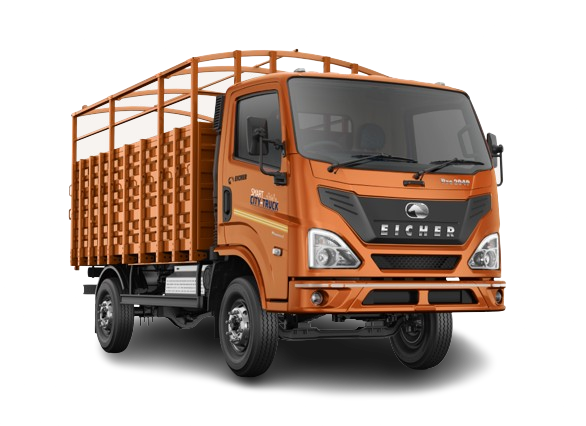
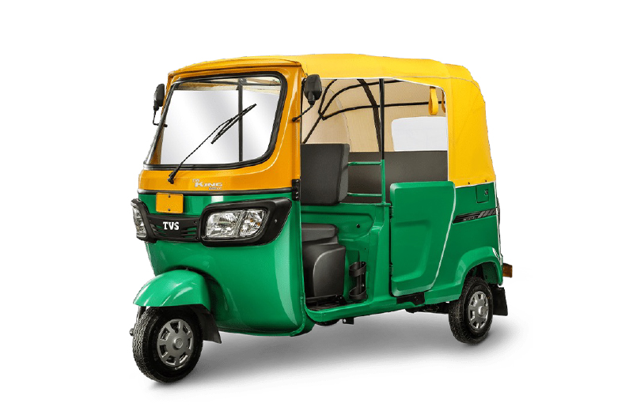

# Image SEO Optimization Guide for Patel Motors

## 🖼️ Why Image SEO Matters

- Google Image Search drives 20-30% of website traffic
- Proper alt text helps blind users and SEO
- Optimized images load faster = better rankings
- Images appear in Google Shopping and product searches

---

## 📝 Alt Text Examples for Your Images

### Current Images - Add These Alt Texts

#### Logo

```html

```

#### Product Images - Bolero

```html


```

#### Product Images - Swift

```html


```

#### Product Images - Pickup

```html


```

#### Product Images - Tata

```html


```

#### Product Images - Hyundai

```html


```

#### Vehicle Category Images

```html





```

---

## 🔧 How to Add Alt Text to Your HTML Files

### In index.html

Find and replace image tags:

**BEFORE:**

```html

```

**AFTER:**

```html

```

### In products.html

Update all product images in the JavaScript file (js/products.js):

```javascript
// Example product object
{
  id: 1,
  name: "Bolero Front Bumper",
  category: "bolero",
  image: "assets/products/bolero-bumper.jpg",
  imageAlt: "Mahindra Bolero Front Bumper - Premium Quality Car Body Part | Patel Motors",
  description: "High-quality front bumper for Mahindra Bolero"
}
```

---

## 📏 Image Optimization Checklist

### 1. Rename Image Files (SEO-Friendly Names)

**CURRENT (Bad):**

- IMG_1234.jpg
- photo.png
- pic1.jpg

**RENAME TO (Good):**

- bolero-front-bumper-patel-motors.jpg
- swift-left-door-panel.jpg
- mahindra-mudguard-havabari.jpg
- pickup-truck-bed-heavy-duty.jpg

### 2. Compress Images (Reduce File Size)

Use these free tools:

- **TinyPNG:** https://tinypng.com
- **Squoosh:** https://squoosh.app
- **ImageOptim:** https://imageoptim.com

**Target sizes:**

- Product images: 50-150 KB
- Hero images: 100-300 KB
- Thumbnails: 10-30 KB

### 3. Use Correct Image Formats

- **JPEG:** For photos (products, vehicles)
- **PNG:** For logos, icons (transparent background)
- **WebP:** Modern format (smaller size, better quality)

### 4. Responsive Images

Add responsive images for mobile:

```html

```

---

## 🎯 Alt Text Formula for Products

Use this formula for consistent alt text:

```
[Vehicle Name] + [Part Name] + [Key Feature] + [Brand/Location]
```

**Examples:**

- "Bolero Front Door Left - OEM Quality | Patel Motors Gujarat"
- "Swift Rear Bumper - Impact Resistant | Patel Motors"
- "Mahindra Pickup Bed - Heavy Duty Steel | Patel Motors"
- "Tata Truck Chassis - Commercial Grade | Patel Motors Mahi"

---

## 📊 Image SEO Best Practices

### ✅ DO:

- Use descriptive file names
- Add alt text to EVERY image
- Compress images before upload
- Use relevant keywords naturally
- Add image captions when possible
- Create image sitemap
- Use high-quality images

### ❌ DON'T:

- Use generic names (image1.jpg)
- Keyword stuff alt text
- Upload huge file sizes (>500KB)
- Use images without alt text
- Copy images from competitors
- Use low-quality images

---

## 🗺️ Create Image Sitemap

Add this to your sitemap.xml:

```xml
<?xml version="1.0" encoding="UTF-8"?>
<urlset xmlns="http://www.sitemaps.org/schemas/sitemap/0.9"
        xmlns:image="http://www.google.com/schemas/sitemap-image/1.1">
  <url>
    <loc>https://patelmotor.in/products.html</loc>
    <image:image>
      <image:loc>https://patelmotor.in/assets/products/bolero-bumper.jpg</image:loc>
      <image:caption>Mahindra Bolero Front Bumper</image:caption>
      <image:title>Bolero Front Bumper - Premium Quality</image:title>
    </image:image>
    <image:image>
      <image:loc>https://patelmotor.in/assets/products/bolero-door.jpg</image:loc>
      <image:caption>Bolero Car Door Left Right</image:caption>
      <image:title>Bolero Door Panel - Original Replacement</image:title>
    </image:image>
    <!-- Add more images -->
  </url>
</urlset>
```

---

## 🔍 Test Your Images

### Google Image Search Test

1. Go to: https://images.google.com
2. Search: "site:patelmotor.in bolero door"
3. Check if your images appear
4. Click on image - should link to your website

### PageSpeed Insights

1. Go to: https://pagespeed.web.dev
2. Enter: https://patelmotor.in
3. Check image optimization suggestions
4. Fix any issues

---

## 📱 Social Media Image Optimization

### Facebook/Instagram Posts

When sharing products on social media:

**Image Size:** 1200 x 630 pixels
**Format:** JPEG
**File Name:** bolero-door-patel-motors-gujarat.jpg

**Caption Template:**

```
🚗 Mahindra Bolero Door - Premium Quality

✅ Perfect fit guaranteed
✅ OEM quality
✅ 2-year warranty
✅ Fast delivery across India

📞 Call: +91 9328629936
🌐 Visit: patelmotor.in

#BoleroSpares #CarBodyParts #PatelMotors #GujaratManufacturer #AutoParts #BoleroAccessories #CarDoor #VehicleParts
```

---

## 🎨 Product Photography Tips

### For Best SEO Results:

1. **White Background:** Clean, professional look
2. **Multiple Angles:** Front, side, back views
3. **Close-ups:** Show quality and details
4. **In-Use Photos:** Installed on vehicle
5. **Comparison Photos:** Before/after, old vs new
6. **Size Reference:** Show scale with ruler/hand

### Photo Checklist:

- ✅ Good lighting (natural or studio)
- ✅ Sharp focus (not blurry)
- ✅ High resolution (at least 1200px wide)
- ✅ Clean product (no dust/scratches)
- ✅ Consistent style across all products

---

## 📈 Track Image Performance

### In Google Search Console:

1. Go to "Performance" tab
2. Click "Search type" → "Image"
3. See which images get clicks
4. Optimize top-performing images

### In Google Analytics:

1. Go to "Behavior" → "Site Content" → "All Pages"
2. Check which product pages get most views
3. Add more images to popular pages

---

## 🚀 Quick Action Plan

### Week 1: Rename & Compress

- [ ] Rename all product images with SEO-friendly names
- [ ] Compress all images using TinyPNG
- [ ] Re-upload optimized images

### Week 2: Add Alt Text

- [ ] Add alt text to all images in HTML files
- [ ] Update JavaScript files with imageAlt property
- [ ] Test all images load correctly

### Week 3: Create Image Sitemap

- [ ] Create image sitemap
- [ ] Submit to Google Search Console
- [ ] Monitor indexing status

### Week 4: Social Media

- [ ] Create product image templates
- [ ] Post 3-5 products per week
- [ ] Use relevant hashtags
- [ ] Link back to website

---

## 📞 Need Help?

If you need assistance with:

- Image editing/compression
- Bulk renaming files
- Creating image sitemap
- Photography tips

Contact a local web developer or graphic designer.

---

**Remember: Good images = More traffic = More customers!**

Start with your best-selling products first, then optimize the rest gradually.

Good luck! 📸
